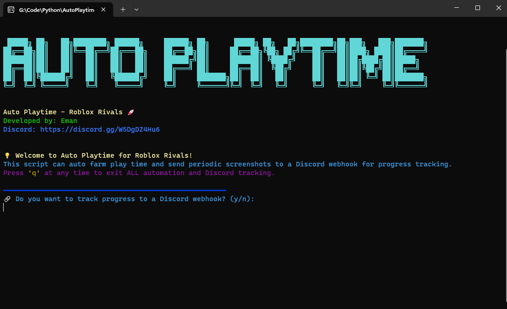

# Auto Playtime Roblox Rivals

A script to do the playtime contracts for Roblox Rivals 



## Installation

Install Auto-Playtime-Roblox-Rivals with python 3.12
https://www.python.org/downloads/release/python-31210/

```python
    python -m pip install -r requirements.txt
    python AutoPlaytime.py
```

# Or run the run.bat from the ZIP [Here](https://github.com/eman225511/Auto-Playtime-Roblox-Rivals/releases/tag/v2)
